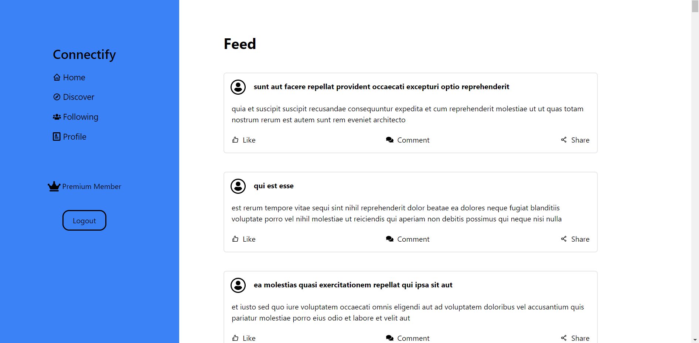
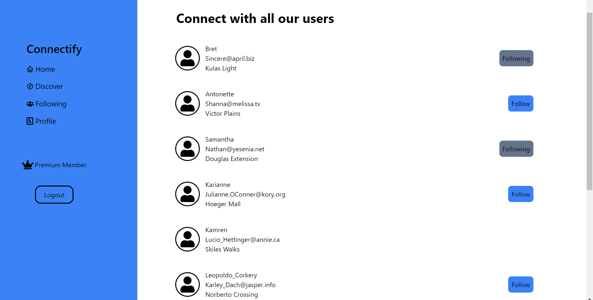
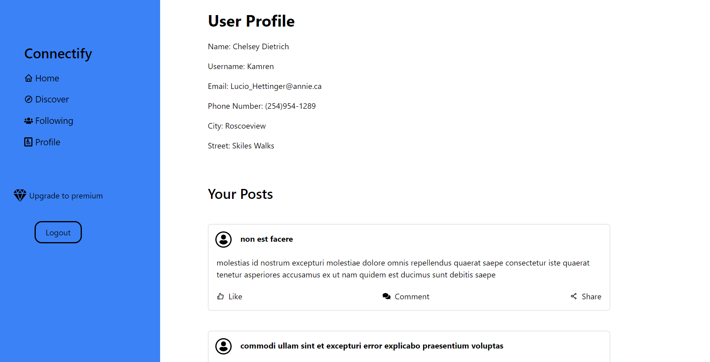
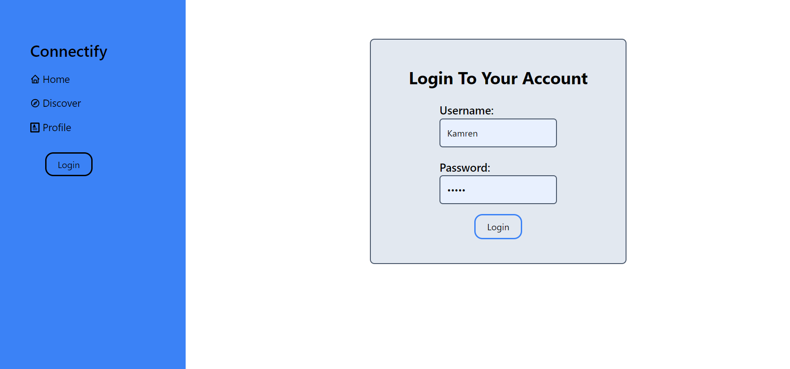
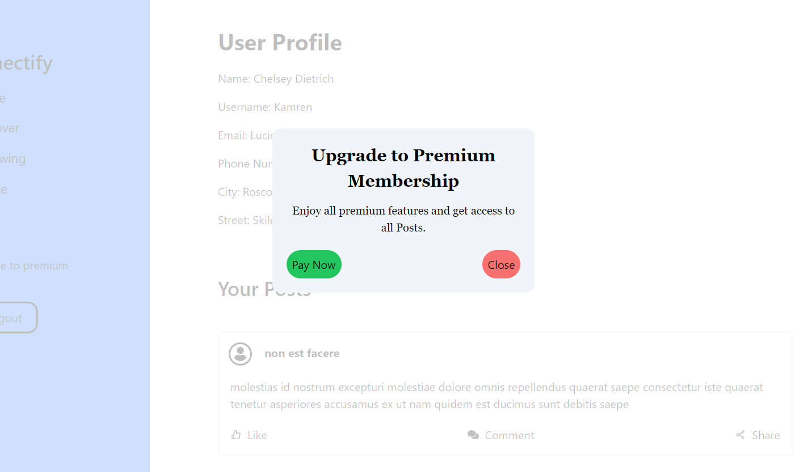

# Welcome to Connectify 

This is a react project bootstrapped using Vite.
To start the application run the following command:

### `npm run dev`

## The App Flow

The first page in the app would be the homepage which contains posts from various users.

The posts are only limited to the first twenty if its an anonymous user or a non-premium user.

Once a user tries to pass that limit while scrolling, a pop up will appear prompting the user to upgrade to premium

The top part of the page contains a list of users that have been followed by the current user.

The second page in the app would be the discover page where all users are displayed and the option to follow them is allowed to authenticated users.

The follow button will not display for the current logged in user.

The profile page consists of the current user's logged in information. That means this page does not display for anonymous users.

Instead the page will redirect them to the login page.

The profile page also contains the current user's posts.

The login page appears when a user is not logged in, otherwise it will stay hidden.

Once a user signs in they will be redirected to the profile page and their sidebar will also change accordingly.

When logged in and you click the upgrade to premium button in the navbar or sidebar depending on your current device, a popup modal will appear allowing you to upgrade your account to a premium version.

Premium users can also exceed the 20 posts limit imposed on other users and view all posts(100).

Should a user choose to they can also just downgrade back to regular joe.

